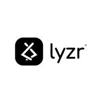

# 🚀 Lydocs - AI-Powered Document Management Platform

  
  
  **Professional Document Management • Powered by Lyzr AI Agents**
  
  
  
  
  

---

## 📋 Overview

**Lydocs** is a revolutionary document management platform that leverages the power of **Lyzr AI Agents** to streamline the entire document workflow - from creation to signature collection. Built with modern web technologies, it transforms how businesses handle professional agreements, proposals, and contracts.

### ✨ Key Features

| Feature | Description | Icon |
|---------|-------------|------|
| **AI Document Generation** | Create professional documents using specialized Lyzr AI agents | 🤖 |
| **Smart Tone Adjustment** | Adjust document tone (professional, formal, friendly, legal) with one click | 🎯 |
| **Interactive Signatures** | Drag-and-drop signature fields with drawing and typing options | ✍️ |
| **Email Integration** | Send documents via email with PDF attachments | 📧 |
| **PDF Export** | Generate professional PDFs with embedded signatures | 📄 |
| **Document Dashboard** | Centralized management with status tracking | 📊 |
| **File Analysis** | Upload and analyze reference documents for better content | 📁 |

---

## 🏗️ Architecture

### 🧠 Lyzr AI Agents Integration

Lydocs utilizes multiple specialized **Lyzr AI Agents** for different tasks:

- 🎨 **Content Generator Agent** - Creates professional document content
- 🎭 **Tone Adjuster Agent** - Modifies document tone and style  
- ⚖️ **Legal Clause Generator** - Adds appropriate legal language
- 🔄 **Section Regenerator** - Refines specific document sections
- ✅ **Document Validator** - Performs quality checks and validation
- 📊 **Document Analyzer** - Analyzes uploaded reference materials

### 🛠️ Tech Stack

\`\`\`
Frontend:     Next.js 15 + TypeScript + Tailwind CSS + shadcn/ui
AI Platform:  Lyzr AI Agents
Storage:      Local Storage + Vercel Blob
Email:        Resend API with mailto fallback
PDF:          jsPDF + html2canvas
Deployment:   Vercel
\`\`\`

---

## 🚀 Getting Started

### Prerequisites

- Node.js 18+ 
- npm or yarn
- Resend API key (optional, for email functionality)

### Installation

1. **Clone the repository**
   \`\`\`bash
   git clone https://github.com/yourusername/lydocs.git
   cd lydocs
   \`\`\`

2. **Install dependencies**
   \`\`\`bash
   npm install
   \`\`\`

3. **Set up environment variables**
   \`\`\`bash
   cp .env.example .env.local
   \`\`\`
   
   Add your API keys:
   \`\`\`env
   RESEND_API_KEY=your_resend_api_key_here
   NEXT_PUBLIC_LYZR_LOGO_URL=your_logo_url_here
   \`\`\`

4. **Run the development server**
   \`\`\`bash
   npm run dev
   \`\`\`

5. **Open your browser**
   \`\`\`
   http://localhost:3000
   \`\`\`

---

## 📱 User Journey

\`\`\`mermaid
flowchart TD
    START([🏁 Start]) --> FORM[📝 Fill Form Company & Client Info]
    FORM --> AI[🤖 Lyzr AI Generates Document]
    AI --> PREVIEW[👀 Preview & Edit]
    PREVIEW --> TONE{🎭 Adjust Tone?}
    TONE -->|Yes| ADJUST[🎯 AI Tone Adjuster]
    TONE -->|No| SIGNATURE
    ADJUST --> SIGNATURE[✍️ Add Signatures]
    SIGNATURE --> SEND[📤 Send & Export]
    SEND --> DASHBOARD[📊 Dashboard]
    DASHBOARD --> END([✅ Complete])
\`\`\`

---

## 🎯 Core Workflows

### 📝 Document Creation
1. **Multi-step Form** - Guided input for company, client, and project details
2. **AI Generation** - Lyzr agents create professional content instantly
3. **Smart Preview** - Review and edit generated documents

### ✍️ Signature Management  
1. **Drag & Drop Fields** - Add signature, date, and text fields anywhere
2. **Flexible Signing** - Draw signatures or type with custom fonts
3. **Multi-signer Support** - Assign fields to different parties

### 📤 Distribution
1. **Email Integration** - Send with professional formatting and PDF attachment
2. **Shareable Links** - Generate secure document links
3. **PDF Export** - Download with all signatures embedded

---

## 🔧 Configuration

### Email Setup (Optional)

To enable email functionality:

1. Sign up for [Resend](https://resend.com/)
2. Verify your domain
3. Add your API key to `.env.local`

Without email setup, the app gracefully falls back to mailto links.

### Lyzr AI Integration

The application comes pre-configured with Lyzr AI agents. The integration handles:
- Document content generation
- Tone adjustments
- Legal clause suggestions
- Content validation

---

## 📊 Features Overview

| Component | Functionality | Status |
|-----------|---------------|--------|
| 🏠 Landing Page | Marketing and feature showcase | ✅ Complete |
| 📊 Dashboard | Document management and overview | ✅ Complete |
| 📝 Document Creator | Multi-step form with AI generation | ✅ Complete |
| 👀 Preview & Editor | Content review and editing | ✅ Complete |
| ✍️ Signature Editor | Interactive signature placement | ✅ Complete |
| 📧 Email Service | Document distribution | ✅ Complete |
| 📄 PDF Export | Professional document export | ✅ Complete |

---

## 🤝 Contributing

We welcome contributions! Please feel free to submit a Pull Request. For major changes, please open an issue first to discuss what you would like to change.

### Development Guidelines

1. Follow TypeScript best practices
2. Use Tailwind CSS for styling
3. Maintain component modularity
4. Write descriptive commit messages

---

## 📞 Contact & Support

### 👨‍💻 Developer

**Email:** [niruwu2006@gmail.com](mailto:niruwu2006@gmail.com)  
**Instagram:** [@_kuoki_](https://instagram.com/_kuoki/)

---

### 🔗 Links

---

## 📄 License

This project is licensed under the MIT License - see the [LICENSE](LICENSE) file for details.

---

## 🙏 Acknowledgments

- **[Lyzr AI](https://lyzr.ai)** - For providing the powerful AI agent platform
- **[Vercel](https://vercel.com)** - For seamless deployment and hosting
- **[shadcn/ui](https://ui.shadcn.com)** - For beautiful, accessible UI components
- **[Resend](https://resend.com)** - For reliable email delivery

---

  
  
  **Built with ❤️ using Lyzr AI Agents**
  
  *Transforming document management through intelligent automation*

